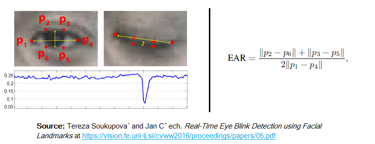
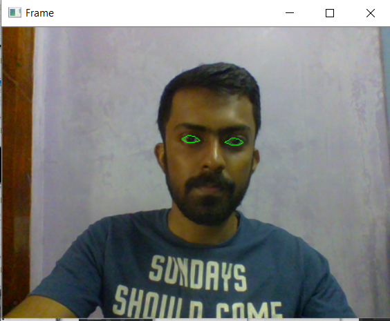
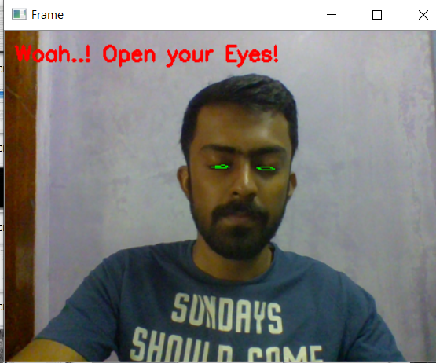

# Drowsiness_Detection_OpenCV

This project is inspired by the Blink Detection project from a blog I read.

We are utilizing the concept of Eye-Aspect-Ratio to determine whether our eyes are closed or open.

The facial landmarks are extracted using the dlib's in-built facial landmark detector. We utilize the six
points which surround each of our eye. Refer to the image below.

The work is majorly based on the paper given below. Please read it if you want to understand it in greater depth.

http://vision.fe.uni-lj.si/cvww2016/proceedings/papers/05.pdf

We can detect whether the driver has closed his eyes for a long duration(say 5s) 
and trigger an alarm or some form of counteractive meaure.

Output of my code:-

When Eyes are open ---->

When Eyes are closed ---->

Tweak the parameters in the code to match your expectations.

Feel free to comment if you find any issue while running the code. 
I am working to extend this project to make other cool applications.

All the best to you! Cheers!

Note :- See the Requirements.txt file for the details of the libraries used.

